# КТ-5 - API с Repository и UnitOfWork

Студент - Денисенко Даниил Евгеньевич  
Группа - 4п4.23 NET  
Дисциплина - ADO.NET  

### Задачи:

1. Подготовка проекта:

   Создайте новый проект ASP.NET Core API

   Настройте подключение к базе данных с использованием Entity Framework Core.

2. Моделирование данных:

   Определите сущности для вашего API. Например, Product, Category.

   Создайте контекст базы данных и определите DbSet для ваших сущностей.

3. Реализация шаблона Repository:

   Создайте интерфейсы IRepository и IUnitOfWork.

   Реализуйте классы Repository и UnitOfWork, которые будут использоваться для доступа к данным.

4. Разработка контроллеров:

   Создайте API контроллеры, которые будут обрабатывать запросы к вашим сущностям.

   Реализуйте CRUD операции для каждой из сущностей.

5. Работа с данными:

   Используйте миграции для создания и обновления схемы базы данных.

   Заполните базу данных начальными данными.

6. Тестирование API:

   Протестируйте ваше API с использованием Postman или аналогичного инструмента.

### Задание 1

Создан ASP.NET Core API с Entity Framework Core и SQLite
База хранится в App_Data/shop.db, подключение настроено в appsettings.json

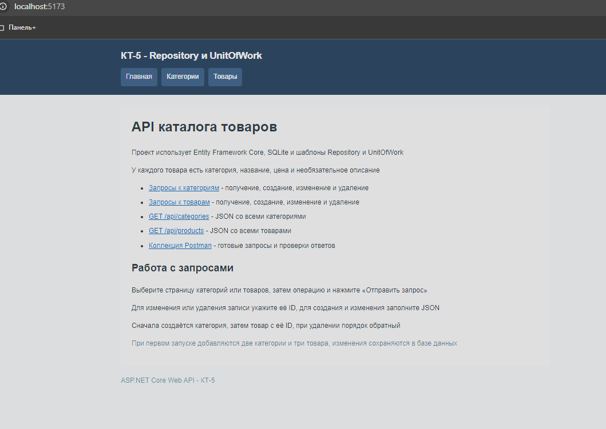

Открой http://localhost:5173/ и сними главную страницу с меню и ссылками

### Задание 2

Созданы Category и Product, каждый товар относится к одной категории
В AppDbContext добавлены DbSet Categories и Products

### Задание 3

IRepository и Repository отвечают за получение, добавление, изменение и удаление данных
IUnitOfWork и UnitOfWork объединяют репозитории и сохраняют изменения через SaveChangesAsync

### Задание 4

Контроллеры CategoriesController и ProductsController поддерживают GET, POST, PUT и DELETE
Маршруты: /api/categories и /api/products, для отдельной записи добавляется /{id}

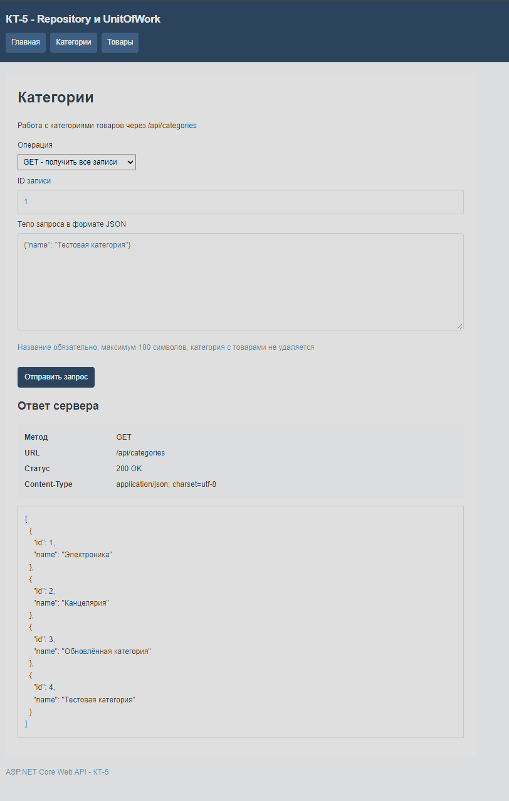

На /categories.html отправь «GET - получить все записи», сними две начальные категории и статус 200

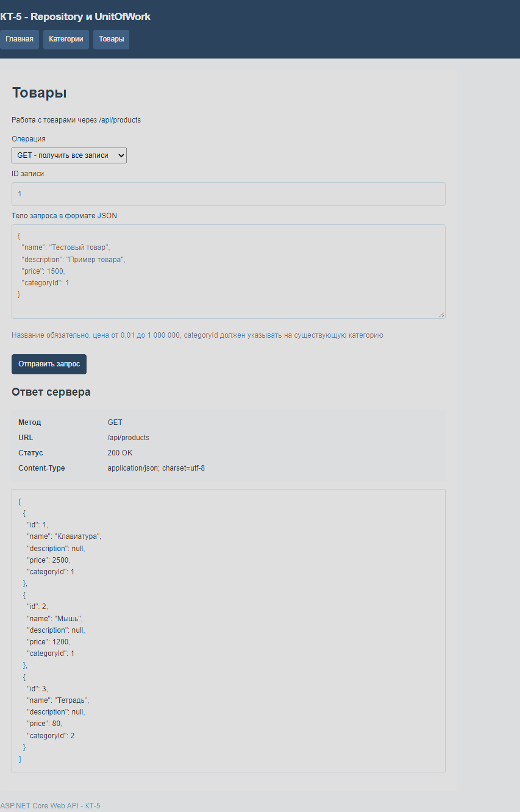

На /products.html отправь «GET - получить все записи», сними три начальных товара и статус 200

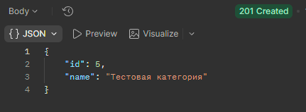

Запрос «03 - Создать категорию»: новая категория, её ID и статус 201

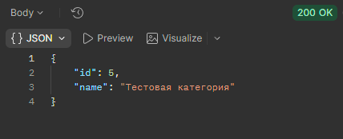

Запрос «04 - Категория по ID»: созданная категория и статус 200

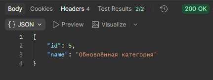

Запрос «05 - Изменить категорию»: новое название и статус 200

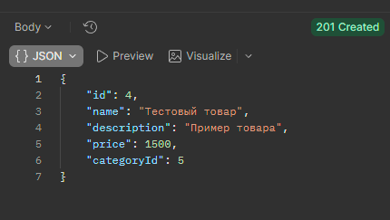

Запрос «06 - Создать товар»: новый товар с ценой 1500, ID и статус 201

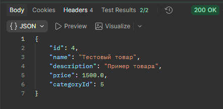

Запрос «07 - Товар по ID»: созданный товар и статус 200

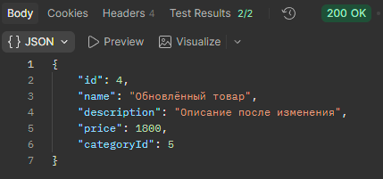

Запрос «08 - Изменить товар»: новое название, цена 1800, описание и статус 200

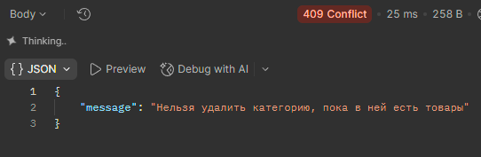

Запрос «09 - Категория с товарами»: удаление запрещено, статус 409

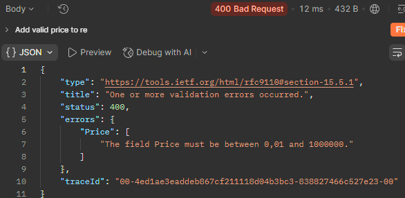

Запрос «10 - Неверная цена»: цена -1, ошибка Price и статус 400

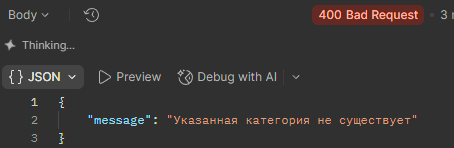

Запрос «11 - Несуществующая категория»: категория не существует, статус 400

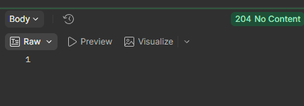

Запрос «12 - Удалить товар»: статус 204, ответ без тела

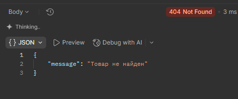

Запрос «13 - Удалённый товар»: товар не найден, статус 404

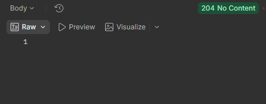

Запрос «14 - Удалить категорию»: статус 204, ответ без тела

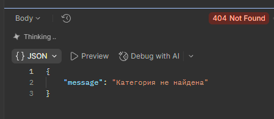

Запрос «15 - Удалённая категория»: категория не найдена, статус 404

### Задание 5

InitialCreate создаёт таблицы и добавляет две категории и три товара
AddProductDescription добавляет описание товара, миграции применяются при запуске
Изменения сохраняются в базе после перезапуска

### Задание 6

Подготовлена [коллекция Postman](wwwroot/postman/kt5.postman_collection.json) из 15 запросов
Импортируй её через Import, адрес baseUrl: http://localhost:5173
Сборка и HTTP-проверки API прошли, снимки и запуск коллекции в Postman выполняет пользователь

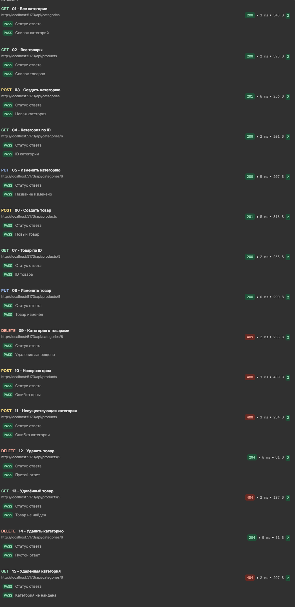

После home16.png выполни Run collection с одной итерацией и сними итог успешных проверок
